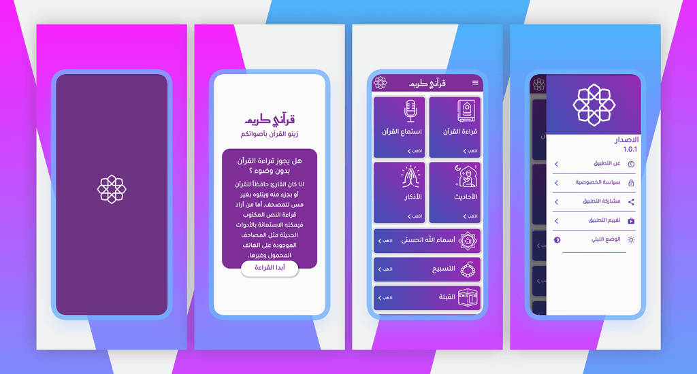
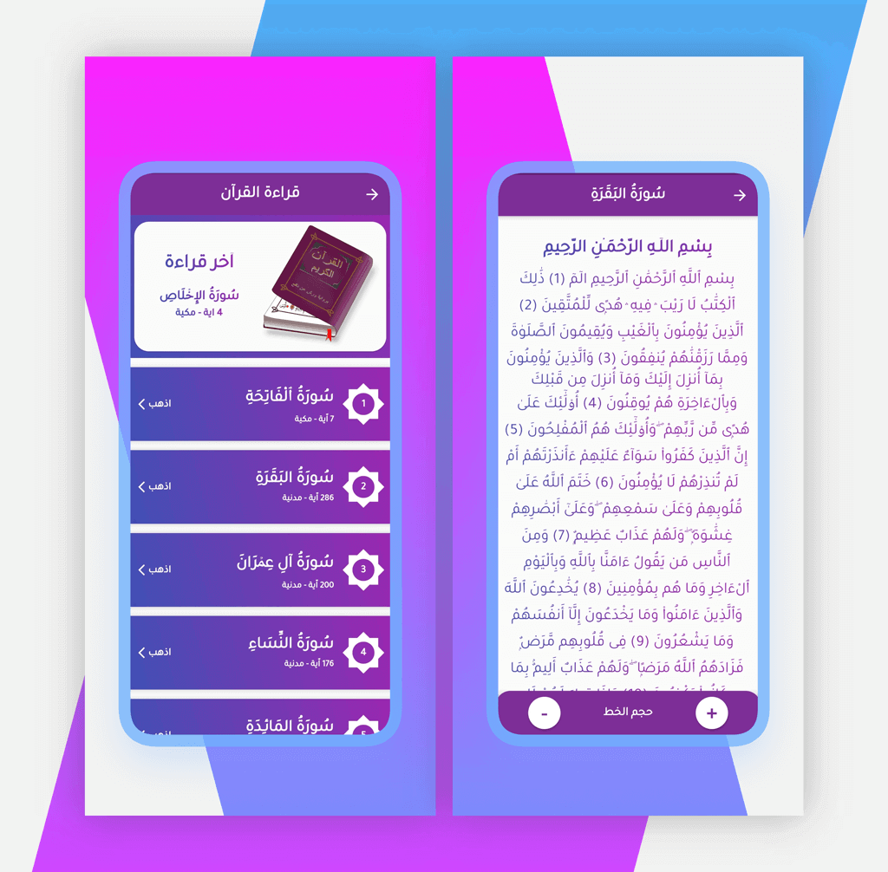
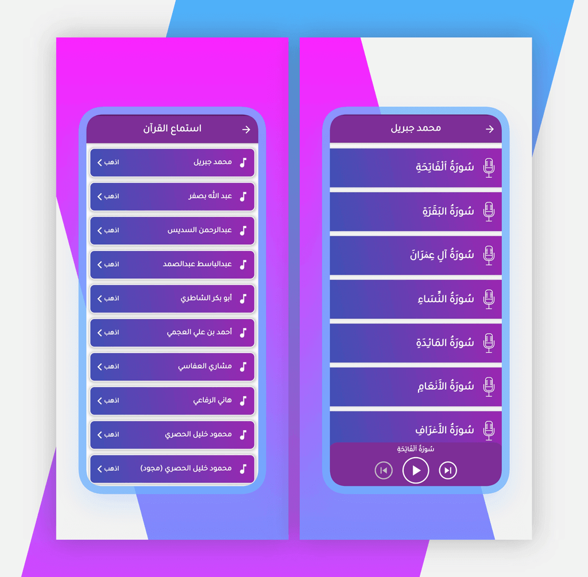
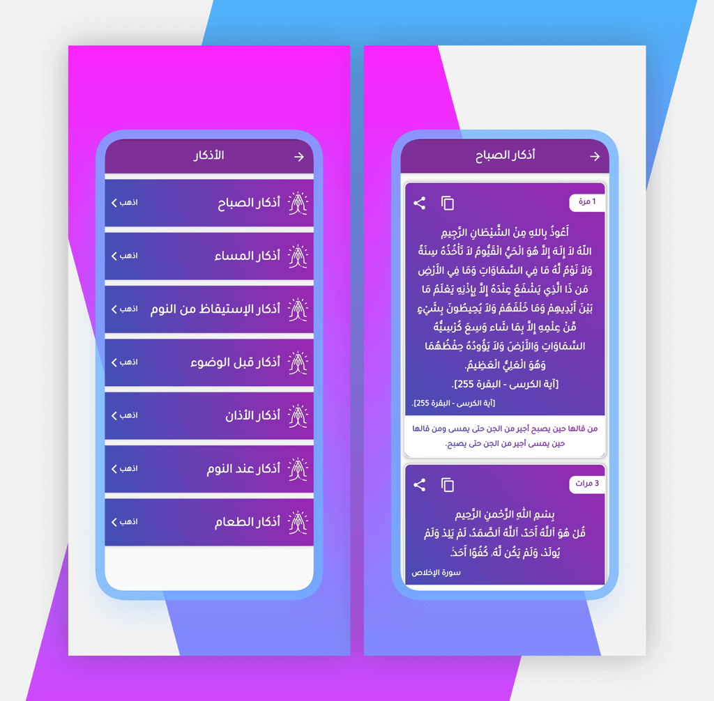
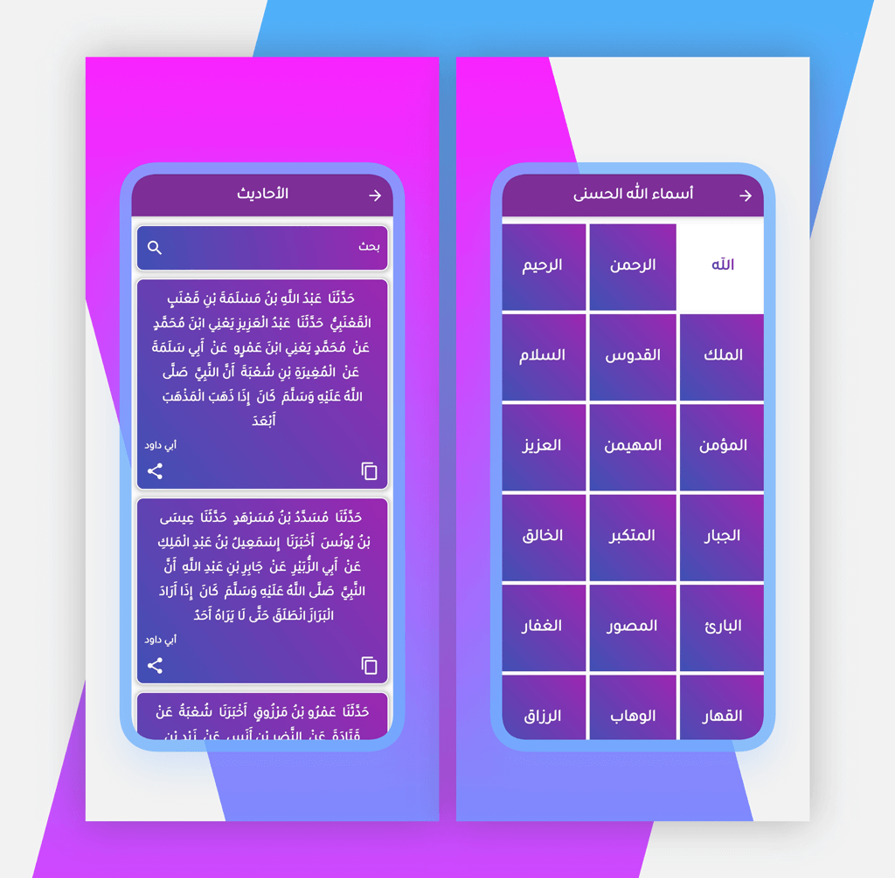
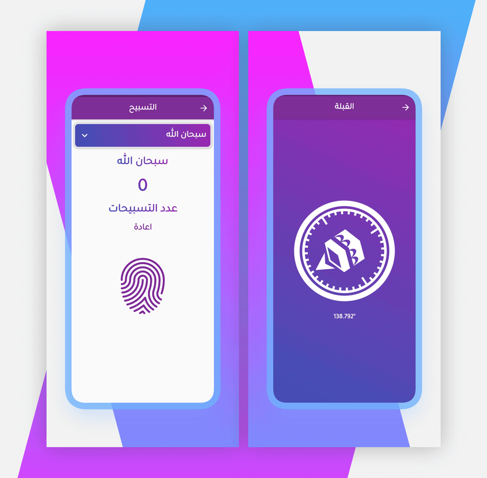
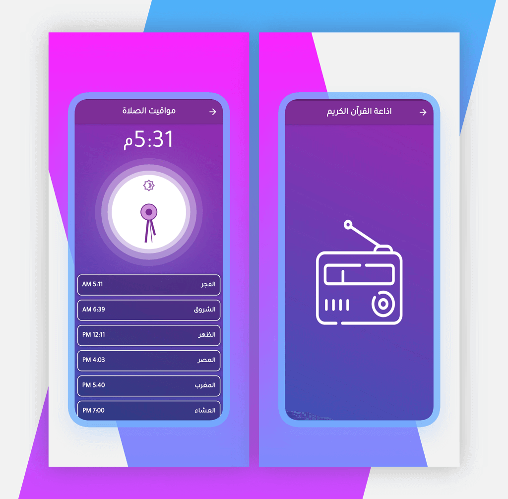
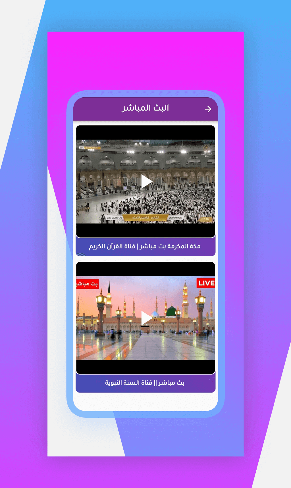

# Qurani Karim

### Qurani Karim is the islamic application that you can read quran and listen to it.

-----------------------------------------------------------------------------

## App Design :

-----------------------------------------------------------------------------

### Plugins and Concepts :

- This project is built using MVVM architecture pattern with Provider for state management.
- Functional programming concept using dartz plugin for handling server errors and exceptions.
- Dio package to call api.
- Hive database to caching data on local storage.
- Pull To Refresh to make a pagination on local data.
- Assets Audio Player package to play audio from remote api and streaming on radio api.
- YouTube Player Flutter package to play live channels from (https://www.youtube.com/). 
- Qiblah package to detect qiblah about current device location.
- Geolocator and Adhan packages to detect current location point from GBS and after that detect prayer times.
- Screen util package for responsive design.
- Remote data from (https://alquran.cloud/api) api source.

-----------------------------------------------------------------------------

### App Features :

- Native Splash screen.
- Reading and Listening All Quran.
- Assmaa Allah Alhosna and all descrption for one of theme.
- Digital Rosary.
- The noble hadiths of the Prophet.
- Qiblah.
- Prayer Times.
- Radio.
- Live YouTube channels.
- Dark mode and Light mode.

-----------------------------------------------------------------------------

